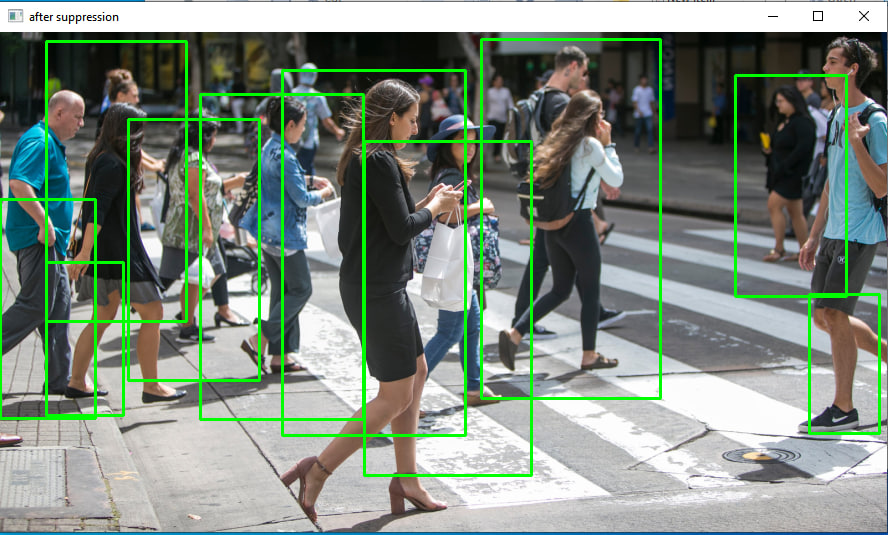

# People-recognition

This Python code uses the OpenCV library and the imutils library to perform pedestrian detection on an input image. The pedestrian detection is based on Histogram of Oriented Gradients (HOG) and non-maximum suppression techniques.

The steps are as follows: 

1. Import necessary libraries:
- import cv2
- from imutils.object_detection import non_max_suppression
- from imutils import resize
- import numpy as np

2. Initialize the HOG descriptor for pedestrian detection:
- hog = cv2.HOGDescriptor()
- hog.setSVMDetector(cv2.HOGDescriptor_getDefaultPeopleDetector())
  
the Histogram of Oriented Gradients (HOG) descriptor is created and set with a pre-trained Support Vector Machine (SVM) detector for pedestrian detection.

3. Read and resize the input image:
- img = cv2.imread('d.jpg')
- img = resize(img, height=500)
  
The code reads an image called 'd.jpg' and then resizes it to a height of 500 pixels while maintaining the aspect ratio. Of course we can give any height we want. 

4. Perform pedestrian detection using HOG:
- rects, weights = hog.detectMultiScale(img, winStride=(4, 4), padding=(8, 8), scale=1.05)

The detectMultiScale function is used to perform pedestrian detection. It takes the resized image and returns a list of bounding boxes (rects) where pedestrians are detected and their corresponding weights (confidences).

5. Draw bounding boxes around detected pedestrians (before non-maximum suppression):
- copy = img.copy()
- for x, y, w, h in rects:
    - cv2.rectangle(copy, (x, y), (x+w, y+h), (0, 0, 255), 2)

A copy of the input image is made, and then bounding boxes are drawn around the detected pedestrians using the cv2.rectangle function. These bounding boxes are drawn in red (0, 0, 255) with a thickness of 2. 

6. Show the image with bounding boxes before non-maximum suppression:
- cv2.imshow('before suppression', copy)
- cv2.waitKey(0)

This displays the input image with the bounding boxes drawn around the detected pedestrians. The program waits for a key press to continue.

7. Perform non-maximum suppression to remove overlapping bounding boxes:
- r = np.array([[x, y, x+w, y+h] for x, y, w, h in rects])
- pick = non_max_suppression(r, probs=None, overlapThresh=0.65)

Non-maximum suppression is applied to remove redundant bounding boxes. The function non_max_suppression takes a list of bounding boxes (r) and returns a list of selected bounding boxes (pick) after suppressing the overlapping ones. The overlapThresh parameter (0.65) defines the overlap threshold; if the overlap between two boxes is greater than this value, one of them will be suppressed.

8. Draw bounding boxes around detected pedestrians (after non-maximum suppression):
- for xa, ya, xb, yb in pick:
    - cv2.rectangle(img, (xa, ya), (xb, yb), (0, 255, 0), 2)

The selected bounding boxes after non-maximum suppression are used to draw green (0, 255, 0) rectangles around the detected pedestrians in the original image.

9. Show the final image with bounding boxes after non-maximum suppression:
- cv2.imshow('after suppression', img)
- cv2.waitKey(0)

This displays the original image with the final bounding boxes drawn around the detected pedestrians after non-maximum suppression.

10. Close all open windows:
- cv2.destroyAllWindows()

The result before and after can be seen bellow!

 

 
